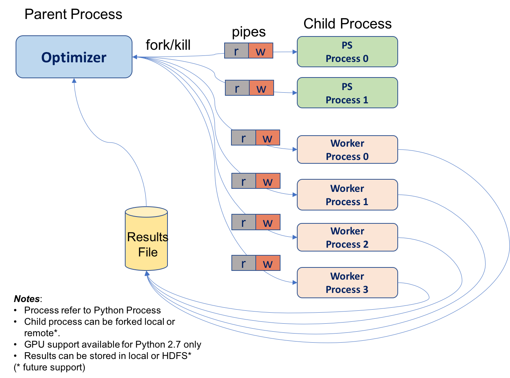

DNN HYPER_PARAM OPTIMIZER FRAMEWORK USING DISTRIBUTED TENSORFLOW  
================================================================  
Author: Srini Ananthakrishnan  
Version: 1.0  
Updated: 04/28/2017  
  
Optimization framework for Distributed Tensorflow architecture. 

   
  
OPTIMIZER forks multiple PS(Parameter Server) and WORKER(Training Server) python process. These processes will further run   Distributed TensorFlow architecture. Framework supports following Deep Neural Network (DNN) TensorFlow Models:  
1) Feed Forward DNN Regressor  
2) Feed Forward DNN Classifier (Work-In-Progress)  
3) RNN-LSTM Classifier (Work-In-Progress)  
  
Pre Requisites:  
--------------
This framework uses sacred tool and mongodb server for ease of use. 
Please follow the instructions below for SacredBoard & MongoDB Installation Instructions:  
  
$ brew install mongodb # install mongodb  
$ mkdir mongo # create local directory for mongodb to write to  
$ mongod --dbpath mongo # start mongodb server and tell it to write to local folder mongo  
  
$ pip install git+https://github.com/IDSIA/sacred.git # install latest version of sacred  
$ pip install sacredboard # install sacredboard  
$ sacredboard # start sacredboard server  
  
Parameter Configuration:  
------------------------  
  
DEFAULT CONFIG:  
--------------  
  $ python optimizer.py print_config  
  
  

  
CUSTOM CONFIG: (Edit optimizer_config.yaml file as required)  
-------------  
  $ python optimizer.py print_config with optimizer_config.yaml  
    
   
  
  
RUN OPTIMIZER:  
--------------  
  $ python optimizer.py  
  
    
RUN WITH SPECIFIC PARAMETER CHANGE:  
----------------------------------  
  $ python optimizer.py with train_epoch=500  
  
  
TO VIEW OPTIMIZER RUN HISTORY:  
-----------------------------  
  Make sure to keep sacredboard and mongoDB server running when executing above python commandline.  
  To view optimizer run history use http://127.0.0.1:5000/runs  
  
  
  

  
