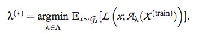
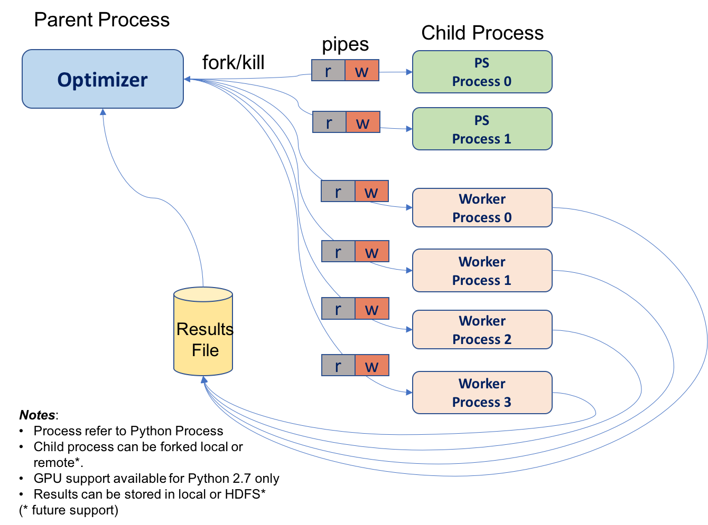
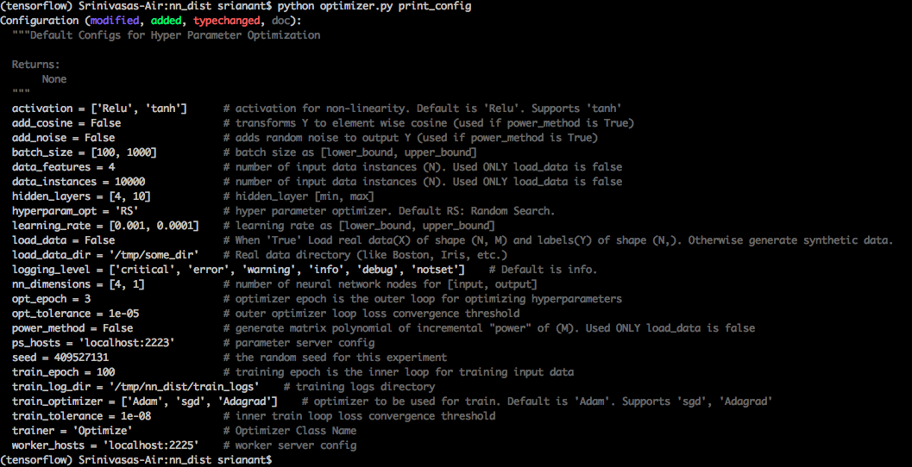
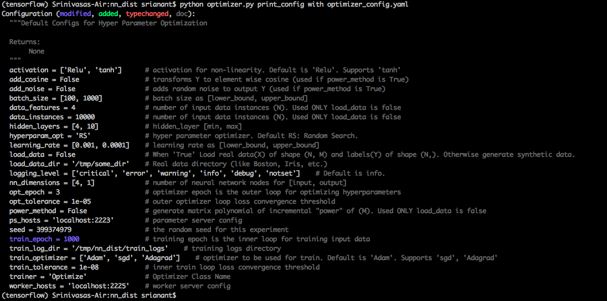
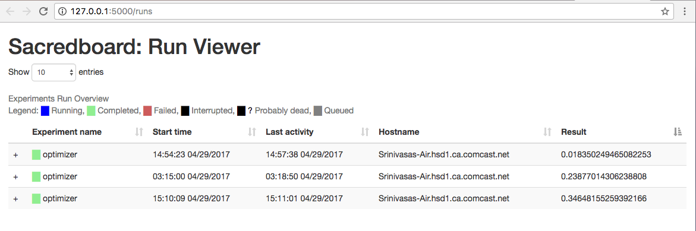

Neural Network Hyper Parameter Optimization (NHOP) Using Distributed TensorFlow
========================================================================  
 
Version: 1.0  
Python: 2.7 & 3.x  
TensorFlow: 1.0.1

## Introduction:
The problem of identifying a good value for hyper- parameter λ usually through an iterative and approximate method is called the problem of hyper-parameter optimization. The computation performed by learning algorithm A involves an inner-loop which is iterative and an outer-loop algorithm that optimizes for hyper-parameters. Given in the form of equation below [[1]](http://www.jmlr.org/papers/volume13/bergstra12a/bergstra12a.pdf)  

  

where,  
Ex is generalization error  
Gx is grand truth distribution  
X (train) is a finite set of samples x from Gx  
L is expected loss L (x; f) over finite samples   
Aλ actual learning algorithm with λ  

NHOP Software framework helps achieve above objective. The framework uses python as its frontend and distributed TensorFlow as its backend for training neural network.  

The Inner-loop optimization is performed using TensorFlow API which are implemented as dataflow-like models. The computations are expressed as stateful dataflow graphs. The Outer-loop called “Optimizer” is a python process that computes hyper-parameters from hyperspace using Random Search [[1]](http://www.jmlr.org/papers/volume13/bergstra12a/bergstra12a.pdf) algorithm and feeds them to inner-loop which trains the finite set of samples X (train) iteratively that minimizes some of the expected loss. Given all that what we need in practice is a way to choose λ so as minimize generalization error. NHOP framework allows users to specify distribution bounds (or) search space for hyper- parameter.  

## Architecture:  

Neural Network Hyperparameter Optimization Framework in Python using Distributed Tensorflow Architecture.

  

OPTIMIZER forks multiple PS(Parameter Server) and WORKER(Training Server) python process. These processes will further run   Distributed TensorFlow Architecture. Framework supports following Deep Neural Network (DNN) TensorFlow Models:  
1) Feed Forward DNN Regressor  
2) RNN-LSTM Classifier  (example for custom model)  

## Design:
[Software design](https://github.com/srianant/DNN_Hyperparameter_Optimization/blob/master/Capstone_project_NHOP.pdf)  

## Pre Requisites:  

This framework uses sacred tool and mongodb server for ease of use.
Please follow the instructions below for SacredBoard & MongoDB Installation:  

$ brew install mongodb # install mongodb  
$ mkdir mongo # create local directory for mongodb to write to  
$ mongod --dbpath mongo # start mongodb server and tell it to write to local folder mongo  

$ pip install git+https://github.com/IDSIA/sacred.git # install latest version of sacred  
$ pip install sacredboard # install sacredboard  

**start sacredboard server (optional..needed to view sacredboard dasboard. CPU intensive when used.)**  
$ sacredboard

## Parameter Configuration:  

### DEFAULT CONFIG:  

  $ python optimizer.py print_config  

  

### CUSTOM CONFIG:
(Edit optimizer_config.yaml file as required)  

  $ python optimizer.py print_config with optimizer_config.yaml  

   

## RUN OPTIMIZER:  

  $ python optimizer.py  

### RUN WITH SPECIFIC PARAMETER CHANGE:  

  $ python optimizer.py with train_epoch=500  

## TO VIEW OPTIMIZER RUN HISTORY:  

  Make sure to keep sacredboard and mongoDB server running when executing above python commandline.  
  To view optimizer run history use http://127.0.0.1:5000/runs  

  
